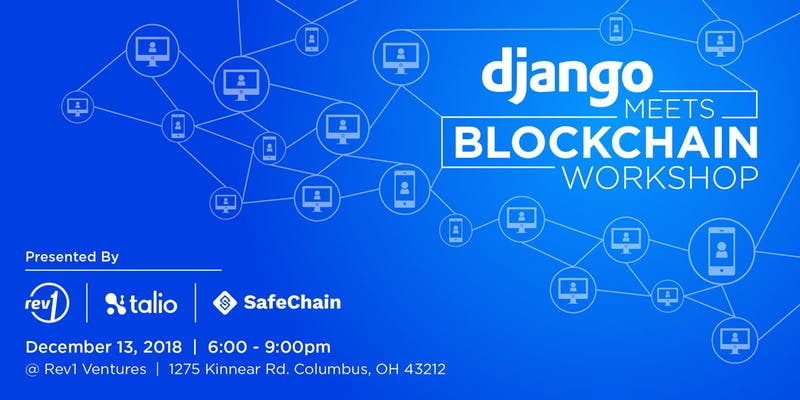

Want to learn how easy it is to craft modern JSON-based APIs using Django REST Framework but can’t seem to find the time? Eager to dive into the emerging world of smart contracts and building on top of the Ethereum blockchain but don’t know where to start?

Join Rev1, SafeChain and Talio for a FREE, intensive, 3-hour bootcamp that will have you build a live RESTful API using Django REST Framework, run your first transaction on the Ethereum blockchain using Web3.js and, finally, prove your abilities in our final challenge by claiming your one-of-a-kind Ohio token.

We’ll kick off the evening promptly at 6pm with a gentle introduction to models, routes and views in Django REST Framework and how to ease yourself into Python syntax (useful if you’re new or coming from another language such as .Net or Java.) You’ll then have an opportunity to dive right in to a live exercise to build your very first API endpoint on top of DRF with help from seasoned instructors and TAs from Talio.

From there, SafeChain will give an overview of how they’re using Ethereum blockchain to make real estate transactions more secure, followed by a brief group discussion of other potential applications. Lastly, Talio instructors will give a brief crash course on the fundamentals of Web3.js and how to run a transaction on the blockchain, after which attendees will dive into their second lab exercise of the evening.

Agenda

- 5:45pm: Arrive, check in
- 6:00pm: Introductions & A Gentle Introduction to Django+REST Framework
- 6:30pm: RESTful API lab exercise
- 7:30pm: A chat about blockchain and how it’s used at SafeChain
- 8:00pm: Ethereum blockchain lab exercise and final challenge
- 9:00pm: Close

Presented by Rev1 Ventures, SafeChain and Talio Technology

#### About Rev1
Rev1 Ventures is an investor startup studio that combines capital and strategic services to help startups scale and corporates innovate. Based in the Midwest, and in a top city for scaling startups, Rev1 aligns innovators and founders with corporate and research partners to access customers and markets, helping entrepreneurs build great companies. With a proven track record of identifying, guiding, and investing in high potential startups, Rev1 helps companies solve real problems for markets in need of real solutions. Rev1 has ~$90MM in capital under management, providing a capital continuum from corporate and community partners, as well as Ohio Third Frontier. Rev1 has been named among the Most Active VCs in the Great Lakes Region for the past four years in a row according to PitchBook. For more information, visit www.rev1ventures.com.

#### About SafeChain
SafeChain leverages advanced software technologies including blockchain to increase the speed and security of real estate property transactions. As the winner of 2018 VentureOhio Seed Startup of the Year, SafeChain was instrumental in Columbus Ohio being named #1 Rising Cities For Startups by Forbes.

#### About Talio
Talio works with the world's most innovative companies to develop and deliver high-intensity technical onboarding and upskilling bootcamps, workshops and learning events. Each program is fully customized specifically around a team's goals, tech stack and culture and we run the event live at the location of our client's choosing, either on-demand or on a recurring basis.
