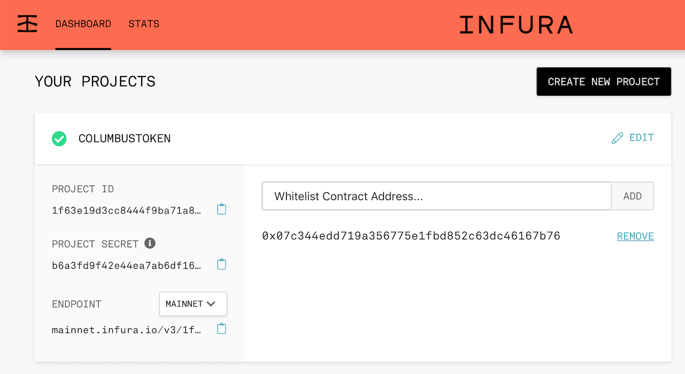

### Setup

Begin by forking the following repository, which contains some assets to get you started:

> [https://github.com/taliotech/django-meets-blockchain](https://github.com/taliotech/django-meets-blockchain)

Next, clone your fork of the repository locally and navigate to the clone folder in a terminal window. You should be able to run `git status` from the folder to confirm your clone is setup correctly.

```shell
git clone https://github.com/YOURUSERNAME/django-meets-blockchain.git
cd django-meets-blockchain
git status
```

Next, you'll need to launch the Vagrant virtual development environment:

```shell
vagrant up
```

This command will take several minutes to complete, as Vagrant will download the base image for the virtual machine (Ubuntu 18.04) and configure it for development by installing Node, Python, and Django. A Postgres database instance is also installed and configured to support the persistence layer. Subsequent runs of `vagrant up` should complete much more quickly.

Vagrant facilitates development by sharing a local folder with the VM; this way you can edit source code on your host machine and execute it inside the guest VM. At this point, you should open the cloned repository folder `django-meets-blockchain` inside a text editor before proceeding.

Once the VM is up and running, SSH into the VM:

```shell
vagrant ssh
```

The command prompt should change, indicating you're interacting with the CLI of the VM and not your host machine. You should see a prompt that looks like this:

```shell
(dmb-api) vagrant@vagrant:~/dmb-api$
```

That `/dmb-api` folder in the Vagrasnt VM maps to the repository clone folder on your local drive.

The Vagrant VM sets up a functioning Python 3.6 virtual environment, but before beginning, you'll need to install some specific modules: `django`, `djangorestframework`, and `web3`. Use the Python package installer, `pip3`, to do this:

```shell
pip3 install django djangorestframework web3
```

### Scaffolding

Django and DRF provide good tools for building out a new project from scratch. So, from the initial directory (which should map to the repository clone's root directory), execute the following commands:

```shell
# Set up a new project with a single application; note the . at the end
django-admin startproject api .
# Set up a new module within the project
django-admin startapp core
```

The project layout should look like:

```shell
ls -l
drwxr-xr-x 1 vagrant vagrant   224 Dec 13 20:29 api
drwxr-xr-x 1 vagrant vagrant   352 Dec 13 20:36 core
-rw-r--r-- 1 vagrant vagrant 40960 Dec 13 20:38 db.sqlite3
drwxr-xr-x 1 vagrant vagrant    96 Dec 13 20:05 etc
-rwxrwxr-x 1 vagrant vagrant   535 Dec 13 20:28 manage.py
-rw-r--r-- 1 vagrant vagrant    73 Dec 13 20:01 README.md
-rw-r--r-- 1 vagrant vagrant   148 Dec 13 20:11 requirements.txt
-rw-r--r-- 1 vagrant vagrant   790 Dec 13 20:19 Vagrantfile
```

> In the instructions that follow, file paths will be given relative to this folder, which should map to the repository root directory on the host machine

Now, sync your database for the first time:

```shell
python manage.py migrate
```

You'll also need to create an initial user named `admin` with a password of your choice. Note this password as you'll need to authenticate as that user later.

```shell
python manage.py createsuperuser --email admin@example.com --username admin
```

Once you've set up a database and the initial user is created and ready to go, open up the app's directory in a text editor to get coding!

### Adding an Endpoint

To create the `/wallets` endpoint, you'll need to code three main elements:

- The **Model** that defines the `Wallet` data structure
- The **Serializer** that reads and writes the model from and to its persistent state
- The **ViewSet** that controls how records are queried from the data store

#### Model

First, declare the model for `Wallet`. Nominally, you'll want to store two basic fields: the `address` and a descriptive `label`.  In `core/models.py`, do this by adding the following code:

```python
# Create your models here.

class Wallet(models.Model):
    label = models.CharField(max_length=255)
    address = models.CharField(max_length=255)

    def __str__(self):
        return u'{} ({})'.format(
            self.label,
            self.address
        )
```

#### Serializer

Next, add the serializer for `Wallet`. Create a new file called `core/serializers.py` and add the following code:

```python
from .models import Wallet
from rest_framework import serializers

class WalletSerializer(serializers.HyperlinkedModelSerializer):
    class Meta:
        model = Wallet
        fields = ('id', 'label', 'address')
```

Notice the field list includes the implicit `id` in addition to the two declared fields, `address` and `label`. Notice also that we're enabling hyperlinked relations in this case with `HyperlinkedModelSerializer`. You could also use primary key and various other relationships, but hyperlinking is good RESTful design.

#### ViewSet

Next, add the viewset declaration in `core/views.py` (leave the existing `import` statement and add the following code):

```python
from .models import Wallet
from .serializers import WalletSerializer
from rest_framework import viewsets

class WalletViewSet(viewsets.ModelViewSet):
    """
    This viewset automatically provides `list`, `create`, `retrieve`,
    `update` and `destroy` actions.
    """
    queryset = Wallet.objects.all().order_by('id')
    serializer_class = WalletSerializer
```

Note this is a very simple query that returns all `Wallet` records, ordered by `id`.

#### Wiring

Finally, you'll need to configure the URL for the new endpoint and add the app into the project's settings.

In `api/urls.py`, _replace_ the existing code with the following:

```python
from django.conf.urls import url, include
from rest_framework import routers
from core import views as core_views

router = routers.DefaultRouter()
router.register(r'wallets', core_views.WalletViewSet)

# Wire up our API using automatic URL routing.
# Additionally, we include login URLs for the browsable API.
urlpatterns = [
    url(r'^', include(router.urls)),
    url(r'^api-auth/', include('rest_framework.urls', namespace='rest_framework'))
]
```

In `api/settings.py`, add entries for `rest_framework` and `core` to `INSTALLED_APPS`:

```json
INSTALLED_APPS = [
    'django.contrib.admin',
    'django.contrib.auth',
    'django.contrib.contenttypes',
    'django.contrib.sessions',
    'django.contrib.messages',
    'django.contrib.staticfiles',
    'rest_framework',
    'core'
]
```

#### Add Migrations and Run the Server

Since you've added a new model, you need to create and run new migrations to update the database. Run the following two commands:

```
python manage.py makemigrations
python manage.py migrate
```

Finally, start the server (note this command should be executed _inside_ the VM) so you can test the app:

```
python manage.py runserver 0.0.0.0:8000
```

Now you should be able to access the new endpoint at [http://localhost:8000/wallets/](http://localhost:8000/wallets/)

Try adding a new wallet using the form, then reload the endpoint to make sure it was added. You can verify the data is correct by looking at the JSON output as well: [http://localhost:8000/wallets/?format=json](http://localhost:8000/wallets/?format=json)

#### Add Validation

Our `Wallet` model is pretty basic at this point, so let's add some validation logic to make it a bit more robust. Django supports both [default and custom validators](https://www.django-rest-framework.org/api-guide/validators/), so we'll add one of each.

Nominally, since each wallet address is unique, you'll want to avoid creating multiple records for the same wallet address, so the first validator should check that there isn't already a record using the same address. This can be handled cleanly via Django's `UniqueValidator`, which can be declared inline in the model's field declaration.

In `core/models.py`, modify the `address` field declaration to include the `unique=True` directive. Additionally, you can change the length of the field to 42, which is the length of a valid blockchain address. The new declaration should look like this:

```python
address = models.CharField(max_length=42, unique=True)
```

Test this by trying to add a second record using the same address; you should get an error messages.

Additionally, it'd be good to make sure that the value for `Wallet.address` is actually a valid Ethereum wallet address. To do this, you'll need to add a custom validator to the serializer in `core/serializers.py`.

Web3 provides [a handy method](https://web3py.readthedocs.io/en/stable/overview.html?#addresses) for performing this validation, so first, add the `import` directive for Web3 to the top of the file:

```python
from web3 import Web3
```

Then, in the `WalletSerializer` class body (following the `class Meta` block, but _not_ within it), add the validation function. Django automatically recognizes functions that follow the naming convention `validate_FIELDNAME` so the function should be named `validate_address`. Call `Web3.isAddress` and raise a `ValidationError` if the check fails; otherwise, return the value:

```python
  def validate_address(self, value):
      """
      Check that the wallet address is valid
      """
      error_message = "Value must be a valid wallet address"
      try:
        # first, convert the address to a checksum address
        value = Web3.toChecksumAddress(value)
      except:
        raise serializers.ValidationError(error_message)
      # check the validity of the address
      if not Web3.isAddress(value):
        raise serializers.ValidationError(error_message)
      return value
```

Now, test this by trying to add a wallet with a random value for address to make sure the validation fails.

### Hello, Blockchain!

Now that we've got a Wallet, let's add some actual blockchain logic as a new endpoint within `/wallets`. We'll start simply by adding an endpoint that checks the wallet's balance, which, being a publicly available information, can be done using only the wallet's address.

Before you begin, though, you'll need to access your [infura.io](https://infura.io) account -- or sign up for one if you didn't already.

In Infura, create a new project. Any name for the project will work; in the example screenshot below, we used `COLUMBUSTOKEN`.

Once you've created a project, the first thing you'll need to do is whitelist the address of the smart contract. The address to use is:

> `0x07c344edD719A356775E1FBd852c63Dc46167B76`

Simply add the above to the project whitelist.



Next, create a new file to contain the blockchain logic in the API called `core/services.py`.

At the top of the file, you'll need a few `import` statements:

```python
import json
import os
from web3 import Web3
```

Web3.py is the library you'll be using on both the server and client side to access the API.

Next, you'll need to grab the endpoint URL from your infura.io project page. The URL will have the following form:

> `https://mainnet.infura.io/v3/<INFURA_PROJECT_ID>`

`<INFURA_PROJECT_ID>` will be specific to your account, so copy the URL from the infura.io project page and declare it as a field in the code, then use that field to instantiate the Web3 class:

```python
# Endpoint URL from
PROVIDER_ENDPOINT = "https://mainnet.infura.io/v3/<INFURA_PROJECT_ID>"

# Instantiate the Web3 class using the custom endpoint
web3 = Web3(Web3.HTTPProvider(PROVIDER_ENDPOINT))
```

First, in order to verify configuration and connectivity via Web3, let's add some simple logic to return a wallet's balance and expose that as a new endpoint in our API. Continuing in `core/services.py`, declare a new class, `ColumbusTokenService`, to wrap the blockchain service logic and add a static method called `check_balance` that accepts a wallet address as input and returns its balance in ETH as output:


```python
class ColumbusTokenService(object):

    # returns the balance of the wallet in ETH
    @staticmethod
    def check_balance(address):
        # Get account balance in Wei
        wei_balance = web3.eth.getBalance(address)

        # Convert the account balance from WEI to ETH
        eth_balance = web3.fromWei(wei_balance, "ether")
        print(f"ETH balance: {eth_balance}")

        # return the balance
        return eth_balance
```

Ethereum measures **ETH** in **WEI**, which is the smallest unit that it's divisible by. Therefore, 1 ETH is equal to 1,000,000,000,000,000,000 WEI. Similarly, when working with the ColumbusToken, you'll find that it's also divisible by 18 places. Web3 provides a helper for converting Wei to a balance denominated in Ether.

> [Read more about Ether denominations](http://ethdocs.org/en/latest/ether.html#denominations)


Next, add a new endpoint to the `WalletViewSet` to expose this logic via the API. In `core/views.py`, start by adding four `import` statements at the top of the file:

```python
from rest_framework import renderers
from rest_framework.decorators import action
from rest_framework.response import Response
from .services import ColumbusTokenService
```

Then, add a new function `def` to the end of the `WalletViewSet` class. The entire class is reproduced below for context; you need to add the block starting with `@action`

```python
class WalletViewSet(viewsets.ModelViewSet):
    """
    This viewset automatically provides `list`, `create`, `retrieve`,
    `update` and `destroy` actions.
    """
    queryset = Wallet.objects.all().order_by('id')
    serializer_class = WalletSerializer

    @action(detail=True, renderer_classes=[renderers.JSONRenderer])
    def check_balance(self, request, *args, **kwargs):
        wallet = self.get_object()
        balance_eth = ColumbusTokenService.check_balance(wallet.address)
        return Response(balance_eth)
```

You should already have an entry for your wallet added to the DB from Part 1; if not, go to http://localhost:8000/wallets/ and use the form to add your wallet with its actual address.

Once you have the record, use its numeric ID (_not_ its address) to build a URL that calls the `check_balance` endpoint. For instance, if the ID assigned to your wallet is `1`, you'd use the following URL:

> http://localhost:8000/wallets/1/check_balance

You should see a small amount returned. The wallet you were provided only has a fractional amount of ETH; that's ok, as the ColumbusToken only requires a nominal amount.

Congratulations, you've got blockchain connectivity! In Part 2, we'll dive in to working with the blockchain in a more sophisticated way.

> Tip: Try searching for your wallet on [etherscan.io](https://etherscan.io/) to view more detailed information about it. This is a good way to cross-confirm the results for this lab

## Stretch Goal

Finish early? Try your hand at implementing an optional bonus goal:

1. Add a new field to `Wallet` called `is_default` to flag whether or not a given wallet should be used as the default,
2. Run the migration to update the DB, then mark one of the wallets as the default
3. Add a new list route called `/wallets/default` that returns this default record  
