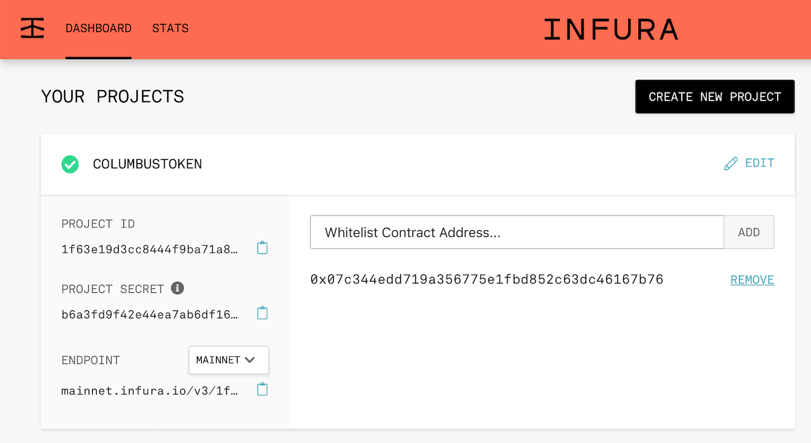

### Objectives

In **Part 1**, we created a simple DRF API with a single endpoint to persist and query wallet data. In this part, we'll extend the API to actually do some real work:

- Connect to the Ethereum mainnet using Web3.py
- Access a pre-deployed smart contract
- Execute a transaction to capture a Columbus token using a live wallet


### Setup

Before you begin, you'll need to access your [infura.io](https://infura.io) account -- or sign up for one if you didn't already.

In Infura, create a new project. Any name for the project will work; in the example screenshot below, we used `COLUMBUSTOKEN`.

Once you've created a project, the first thing you'll need to do is whitelist the address of the smart contract. The address to use is:

> `0x07c344edD719A356775E1FBd852c63Dc46167B76`

Simply add the above to the project whitelist.




Next, create a new file to contain the logic for accessing the token: `django-meets-blockchain-api/core/columbustoken.py`

At the top of the file, you'll need a few `import` statements:

```python
import json
import os
from web3 import Web3 # web3 installed via vagrant, alt: `pip install web3`
```

> TODO: logging

Next, you'll need to grab the endpoint URL from your infura.io project page. The URL will have the following form:

> `https://mainnet.infura.io/v3/<INFURA_PROJECT_ID>`

`<INFURA_PROJECT_ID>` will be specific to your account, so copy the URL from the infura.io project page and declare it as a field in the code, then use that field to instantiate the Web3 class:

```python
# Endpoint URL from
PROVIDER_ENDPOINT = "https://mainnet.infura.io/v3/<INFURA_PROJECT_ID>"

# Instantiate the Web3 class using the custom endpoint
web3 = Web3(Web3.HTTPProvider(PROVIDER_ENDPOINT))
```

### Accessing the Wallet

> TODO: private key source

First, initialize the account using the private key. The private key can also be used to derive the public address of the wallet.

```python
# Use web3.eth.account library to derive the public address from the key.
#
# https://web3py.readthedocs.io/en/stable/web3.eth.account.html
ACCOUNT = web3.eth.account.privateKeyToAccount(PRIVATE_KEY)
print(f"Wallet address: {ACCOUNT.address}")
```

Now that we have an account, let's use Web3.py to check the balance.

```python
# Get account balance in Wei
wei_balance = web3.eth.getBalance(ACCOUNT.address)
```

Ethereum measures **ETH** in **WEI**, which is the smallest unit that it's divisible by. Therefore, 1 ETH is equal to 1,000,000,000,000,000,000 WEI. Similarly, when working with the ColumbusToken, you'll find that it's also divisible by 18 places.

> [Read more about Ether denominations](http://ethdocs.org/en/latest/ether.html#denominations)

Web3 provides a helper for converting Wei to a balance denominated in Ether:

```python
# Convert the account balance from ETH to WEI
eth_balance = web3.fromWei(wei_balance, "ether")
print(f"ETH balance: {eth_balance}")
```

You'll notice the wallet you were provided only has a fractional amount of ETH; that's ok, as the ColumbusToken only requires a nominal amount.

### Working with the Smart Contract

Next, you'll need to initialize the Columbus Token smart contract.

First, declare the address of the deployed ERC-20 contract in the code. This is the same address you whitelisted in the first step, but in this case, it will need to be converted to a checksum address:

```python
# Web3 1.0.0+ requires that we parse the address to a checksum address.
CONTRACT_ADDRESS = Web3.toChecksumAddress('0x07c344edd719a356775e1fbd852c63dc46167b76')
```

You'll need the JSON for contract's application binary interface (ABI), which is available at the following URL:

> https://etherscan.io/address/0x07c344edd719a356775e1fbd852c63dc46167b76#code

Open the above URL in a browser, scroll down to the **Contract ABI** section, then click **Export ABI** and choose **JSON Format**. Save the JSON to `django-meets-blockchain-api/core/ColumbusTokenAbi.json`.


After saving the JSON file, back in the code, load it from the filesystem:

```python
CONTRACT_ABI = ""
with open(os.path.join(os.path.dirname(__file__), 'ColumbusTokenAbi.json')) as json_data:
    abi_json = json.load(json_data)
    # The provided abi was taken from etherscan, which has some extra stuff in it.
    # We just want the 'result' for creating a contract object.
    CONTRACT_ABI = abi_json['result']
```

Now you can instantiate a Web3 `Contract` object for working with the contract:


```python
columbusTokenContract = web3.eth.contract(
    address=CONTRACT_ADDRESS,
    abi=CONTRACT_ABI
    )
```

Great! Now that we have a contract object we can work with, let's get some data from the blockchain!

Let's make sure we're working with the ColumbusToken by making some calls to the contract. The following are "view" functions and can be called for free. All of the readable functions on this contract [can be found online](  https://etherscan.io/address/0x07c344edd719a356775e1fbd852c63dc46167b76#readContract).


```python
# Query the contract name
contract_name = columbusTokenContract.functions.name().call()
print(f"Contract Name: {contract_name}")

# Query the contract symbol
contract_symbol = columbusTokenContract.functions.symbol().call()
print(f"Contract Symbol: {contract_symbol}")

# Query the contract's total supply
contract_totalSupply = columbusTokenContract.functions.totalSupply().call()
print(f"Contract totalSupply: {contract_totalSupply}")
```

You can also use the contract to check the token balance on the input account by passing it as a parameter:

```python
# Check the CBUS token balance of the account
token_balance = columbusTokenContract.functions.balanceOf(ACCOUNT.address).call()
print(f"My CBUS balance: {token_balance}")
```

### Preparing the Transaction

Functions that only read data from the blockchain can be invoked with the `.call()` function; functions that will modify the blockchain state will need to be prepared as **transactions**. In order to request a token from the contract and send it to the input wallet, we'll need a raw transaction.

First, you'll want to set some transaction variables.

Declare a **maximum gas** variable to set the maximum amount of gas to be used in the transaction. This generally prevents your costs from unexpectedly getting out of control by killing the transaction when the gas limit is exceeded. For the ColumbusToken, invoking the `getToken()` method should cost around 69,476 gas, so set a `maximum_gas` variable using a value that's just a little more than that.


```python
# 100K should cover the Columbus Token, which only costs 69476 gas
maximum_gas = 100000
```

A **nonce** value is required for each transaction. It prevents duplicate transactions from being processed by the network and ensures that transactions are processed in the intended order. The nonce is zero-indexed and should be equal to the number of transactions sent by the account. You can use web3's `getTransactionCount(address)` function to get the nonce value for a transaction.

```python
# check the nonce value for the account
nonce = web3.eth.getTransactionCount(ACCOUNT.address)
print(f"nonce: {nonce}")
```

The **chain ID** is the ID of the network we are deploying to. Examples of network IDs:
- 1: Ethereum Mainnet
- 3: Ropsten Testnet
- 4: Rinkeby Testnet

```python
# The web3 call returns the value as a string, but we will need an integer to create a transaction.
chain_id = int(web3.version.network)
print(f"Chain ID: {chain_id}")
```

**Gas price** is defined programatically in wei, but it's typically discussed in GWEI. Luckily, Web3 provides us a method to quickly convert GWEI to WEI.


> Users may want to check https://ethgasstation.info/ prior to sending a transaction to ensure that they don't set too high or low a price.

 - A gas price that's too high can incur needless expense.
 - A price that's too low will mean that your transaction takes longer to process, and if it's very low it may never get processed at all.

```python
gas_price = web3.toWei('10', 'gwei')
print(f"Gas Price: {gas_price} wei")
```

Now you're ready to build the transaction to request a Columbus Token. First, you'll need to build a raw transaction containing the data to be transmitted:

> Reference docs: [web3.contract.ContractFunction.buildTransaction](https://web3py.readthedocs.io/en/stable/contracts.html#web3.contract.ContractFunction.buildTransaction)

```python
# Build the raw transaction
raw_transaction = columbusTokenContract.functions.getToken().buildTransaction({
    'chainId': chain_id,
    'gas': maximum_gas,
    'gasPrice': gas_price,
    'nonce': nonce
})
print(f"Raw Transaction: {raw_transaction}\n")
```

Next, you'll need to cryptographically sign the transaction with the account's private key.

```python
# Sign the raw transaction using the private key via the web3 acount object
signed_transaction = ACCOUNT.signTransaction(raw_transaction)
print(f"Signed Transaction: {signed_transaction}\n")
```

> The ColumbusToken contract contains a unique (and nonstandard) feature that allows an account to claim one CBUS token once upon request. This can actually be abused pretty easily, so it's just a fun way to demonstrate interacting with a smart contract. See [line 57 of the contract's code](https://etherscan.io/address/0x07c344edd719a356775e1fbd852c63dc46167b76#code) to see how this is implemented.


### Capture the Token

Your signed transaction now contains everything it needs to be processed by the network. To get your CBUS Token, add the following line (ensure that there is some ether in your account!):

```python
transaction_hash = web3.eth.sendRawTransaction(signed_transaction.rawTransaction)
print(f"Transaction Hash: {transaction_hash}\n")
```

> TODO: store tx hash?
> TODO: Once the transaction has processed, go back and check your CBUS token balance.
