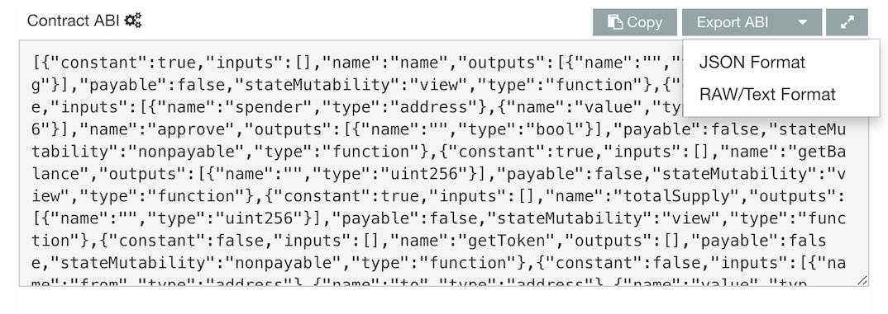

### Checking the CBUS Token Balance

Since we eventually want to capture the Columbus Token to the wallet, let's start by adding a new endpoint within `/wallets` that checks whether or not the wallet has the token already. While it is possible that a wallet could have more than one token, or even a fractional amount of tokens (by way of trading them with others), since the Columbus Token smart contract only allows a wallet to request a single token, the CBUS token balance will generally be either 0 or 1.

This endpoint will essentially be a variation of the `check_balance` endpoint you made in Part 1; let's call this one `check_token_balance`.

Open `core/services.py` to start coding the implementation. Before you start to code the endpoint implementation function itself, you'll need to declare some data about the CBUS token smart contract using Web3 -- but since you'll need this same logic for a later step, you'll want to add the following code to the _header_ area of `core/services.py` -- in other words, the part of the module _before_ the `class ColumbusTokenService` declaration, just after where you declared the infura.io endpoint and initialized the Web3 module in Part 1.

First, declare the address of the deployed ERC-20 contract in the code. This is the same address you whitelisted on infura.io, but in this case, it will need to be converted to a checksum address:

```python
    # Web3 1.0.0+ requires that we parse the address to a checksum address.
    CONTRACT_ADDRESS = Web3.toChecksumAddress('0x07c344edd719a356775e1fbd852c63dc46167b76')
```

You'll need the JSON for contract's application binary interface (ABI), which is available at the following URL:

> https://etherscan.io/address/0x07c344edd719a356775e1fbd852c63dc46167b76#code

Open the above URL in a browser, scroll down to the **Contract ABI** section, then click **Export ABI** and choose **JSON Format**. Save the JSON to `core/ColumbusTokenABI.json`.



After saving the JSON file, back in the code, load it from the filesystem:

```python
    CONTRACT_ABI = ""
    with open(os.path.join(os.path.dirname(__file__), 'ColumbusTokenABI.json')) as json_data:
        abi_json = json.load(json_data)
        # The provided abi was taken from etherscan, which has some extra stuff in it.
        # We just want the 'result' for creating a contract object.
        CONTRACT_ABI = abi_json['result']
```

Now you can instantiate a Web3 `Contract` object for working with the contract:

```python
    columbusTokenContract = web3.eth.contract(
        address=CONTRACT_ADDRESS,
        abi=CONTRACT_ABI
    )
```

Great! Now that we have a contract object we can work with, let's add the actual endpoint implementation. This part of the code should go _within_ the `ColumbusTokenService` class body, just like the `check_balance` endpoint:

```python
  # returns the number of CBUS tokens in the wallet
  @staticmethod
  def check_token_balance(address):

```


Before we grab the token balance, let's use this opportunity to make sure we're working with the ColumbusToken by making some calls to the contract itself. The following are "view" functions and can be called for free. All of the readable functions on this contract [can be found online](  https://etherscan.io/address/0x07c344edd719a356775e1fbd852c63dc46167b76#readContract).

```python
      # Query the contract name
      contract_name = columbusTokenContract.functions.name().call()
      print(f"Contract Name: {contract_name}")

      # Query the contract symbol
      contract_symbol = columbusTokenContract.functions.symbol().call()
      print(f"Contract Symbol: {contract_symbol}")

      # Query the contract's total supply
      contract_totalSupply = columbusTokenContract.functions.totalSupply().call()
      print(f"Contract totalSupply: {contract_totalSupply}")
```

In the same manner, you can use the contract to check the token balance on the wallet, and return that value:

```python
      # Check the CBUS token balance of the account
      token_balance = columbusTokenContract.functions.balanceOf(address).call()
      print(f"CBUS token balance: {token_balance}")
      return token_balance
```

Great. Now, in `core/views.py`, expose this as an endpoint the same way you did in the last part:

```python
  @action(detail=True, renderer_classes=[renderers.JSONRenderer])
  def check_token_balance(self, request, *args, **kwargs):
      wallet = self.get_object()
      token_balance = ColumbusTokenService.check_token_balance(wallet.address)
      return Response(token_balance)
```

Test this endpoint by opening its URL (remember to substitute the numeric ID of your wallet in the URL below if other than `1`):

> http://localhost:8000/wallets/1/check_token_balance

The balance should be zero, which make sense, as you haven't captured the token yet.

### Preparing the Transaction

Up until now, all our blockchain logic has been read-only. Time to get our hands dirty!

First, you'll need to add another endpoint with some more complex logic: creating the transaction that will invoke the smart contract to send the ColumbusToken to the wallet. This endpoint will take care of all the logic right up until the transaction needs to be signed and executed.

In `core/services.py`, add a second function after `check_balance` called `prepare_transaction`. This function will also take the wallet's address as input:

```python
    @staticmethod
    def prepare_transaction(address):
```

Functions that only read data from the blockchain, like those used in the previous endpoints, can be invoked with the `.call()` function; functions that will modify the blockchain state will need to be prepared as **transactions**. In order to request a token from the contract and send it to the input wallet, we'll need a raw transaction.

First, you'll want to set some transaction variables.

Declare a **maximum gas** variable to set the maximum amount of gas to be used in the transaction. This generally prevents your costs from unexpectedly getting out of control by killing the transaction when the gas limit is exceeded. For the ColumbusToken, invoking the `getToken()` method should cost around 69,476 gas, so set a `maximum_gas` variable using a value that's just a little more than that.


```python
      # 100K should cover the Columbus Token, which only costs 69476 gas
      maximum_gas = 100000
```

A **nonce** value is required for each transaction. It prevents duplicate transactions from being processed by the network and ensures that transactions are processed in the intended order. The nonce is zero-indexed and should be equal to the number of transactions sent by the account. You can use web3's `getTransactionCount(address)` function to get the nonce value for a transaction.

```python
      # check the nonce value for the account
      nonce = web3.eth.getTransactionCount(address)
      print(f"nonce: {nonce}")
```

The **chain ID** is the ID of the network we are deploying to. Examples of network IDs:
- 1: Ethereum Mainnet
- 3: Ropsten Testnet
- 4: Rinkeby Testnet

```python
      # The web3 call returns the value as a string, but we will need an integer to create a transaction.
      chain_id = int(web3.version.network)
      print(f"Chain ID: {chain_id}")
```

**Gas price** is defined programmatically in WEI, but it's typically discussed in GWEI. Luckily, Web3 provides us a method to quickly convert GWEI to WEI.

```python
      gas_price = web3.toWei('10', 'gwei')
      print(f"Gas Price: {gas_price} wei")
```

> Users may want to check https://ethgasstation.info/ prior to sending a transaction to ensure that they don't set too high or low a price.

 - A gas price that's too high can incur needless expense.
 - A price that's too low will mean that your transaction takes longer to process, and if it's very low it may never get processed at all.

Now you're ready to build the transaction to request a Columbus Token. First, you'll need to build a raw transaction containing the data to be transmitted:

> Reference docs: [web3.contract.ContractFunction.buildTransaction](https://web3py.readthedocs.io/en/stable/contracts.html#web3.contract.ContractFunction.buildTransaction)

```python
      # Build the raw transaction
      raw_transaction = columbusTokenContract.functions.getToken().buildTransaction({
          'chainId': chain_id,
          'gas': maximum_gas,
          'gasPrice': gas_price,
          'nonce': nonce
      })
      print(f"Raw Transaction: {raw_transaction}\n")
      # return the transaction JSON
      return raw_transaction
```

Finally, open up `core/views.py` again to expose `prepare_transaction` as a new endpoint in `/wallets`, just as you did with `check_balance`:

```python
  @action(detail=True, renderer_classes=[renderers.JSONRenderer])
  def prepare_transaction(self, request, *args, **kwargs):
      wallet = self.get_object()
      raw_transaction = ColumbusTokenService.prepare_transaction(wallet.address)
      return Response(raw_transaction)
```

Now you should be able to access this endpoint by it's URL to see the JSON of the raw transaction. Again, if the ID of your wallet in the DB is `1`, the URL in this case would be:

> http://localhost:8000/wallets/1/prepare_transaction

### Sign and Execute the Transaction

Before the transaction can be executed, it must be signed using the wallet's private key. As previously discussed, the API won't have that key, so the raw transaction JSON must be signed on the client side. To do this, you'll need to make a separate script and execute it outside of the Django server process. For the sake of simplicity, though, you can simply create the script inside the VM so that the same Python stack is available. It will need to interact with the server, though, so be sure to leave the server running.

On your **host** machine, open a new terminal window and navigate to the folder where you cloned the django-meets-blockchain repo. From that folder, run the same command you did in part one: `vagrant ssh`. This will create a second SSH connection to the Vagrant VM, so you should have **two** terminal windows open now -- one running the Django server and the other showing the command prompt inside the VM (`(dmb-api) vagrant@vagrant:~/dmb-api$`).

Create a new file in the root repository folder called `client.py`. You can do this in your text editor or via the terminal. It will appear alongside some of the other Django files like `manage.py` but we'll execute it separate from the DRF server. In the real world, this script would be executed on a different machine, but, again, we're just using the same environment for convenience.

The `client.py` script will also use Web3, so it starts in the same way, with the similar imports and the infura.io endpoint declaration (note you'll need to replace `<INFURA_PROJECT_ID>` with your project ID as before):

```python
import json
from web3 import Web3
import urllib3 # used for interacting with the DRF API

# Endpoint URL from infura.io
PROVIDER_ENDPOINT = "https://mainnet.infura.io/v3/<INFURA_PROJECT_ID>"

# Instantiate the Web3 class using the custom endpoint
web3 = Web3(Web3.HTTPProvider(PROVIDER_ENDPOINT))
```

Next, you'll need to add your private key as a variable; replace `<YOUR_PRIVATE_KEY>` in the snippet below with the value. Note [there are many better ways to work with a local private key](https://web3py.readthedocs.io/en/stable/web3.eth.account.html); declaring it as a field in your code is probably the _worst_ way, but this is a demo script and a demo wallet.

```python
# NOT a good practice,
PRIVATE_KEY = "<YOUR_PRIVATE_KEY>"
```

First, initialize the account using the private key. The private key can also be used to derive the public address of the wallet.

```python
# Use web3.eth.account library to derive the public address from the key.
#
# https://web3py.readthedocs.io/en/stable/web3.eth.account.html
ACCOUNT = web3.eth.account.privateKeyToAccount(PRIVATE_KEY)
print(f"Wallet address: {ACCOUNT.address}")
```

Next, retrieve the raw transaction JSON from the Django server, which will be running at `localhost`, using the same URL you used at the end of the last step. You'll need to initialize the `urllib3` pool, fetch the JSON, and decode it to use it in the script:

```python
# initialize the urllib3 pool manager
http = urllib3.PoolManager()

# get and decode the raw transaction json
raw_transaction_json = http.request('GET', 'http://localhost:8000/wallets/1/prepare_transaction/')
raw_transaction = json.loads(raw_transaction_json.data.decode('UTF-8'))
print(f"Raw Transaction: {raw_transaction}\n")
```

Try running the script from the command line using the new terminal window:

```python
python client.py
```

You should see the same JSON as at the end of the previous step printed to the console.

Next, you'll need to cryptographically sign the transaction with the account object:

```python
# Sign the raw transaction using the private key via the web3 acount object
signed_transaction = ACCOUNT.signTransaction(raw_transaction)
print(f"Signed Transaction: {signed_transaction}\n")
```

> The ColumbusToken contract contains a unique (and nonstandard) feature that allows an account to claim one CBUS token once upon request. This can actually be abused pretty easily, so it's just a fun way to demonstrate interacting with a smart contract. See [line 57 of the contract's code](https://etherscan.io/address/0x07c344edd719a356775e1fbd852c63dc46167b76#code) to see how this is implemented.


Your signed transaction now contains everything it needs to be processed by the network. To get your CBUS Token, add the following line:

```python
transaction_hash = web3.eth.sendRawTransaction(signed_transaction.rawTransaction)
print(f"Transaction Hash: {transaction_hash}\n")
```

At this point, running the script again using `python client.py` will execute the transaction and capture the token to the wallet. Keep in mind you can only do this once -- subsequent runs will fail as the ColumbusToken can only be captured once per wallet!

Did you capture the token? Use the `check_token_balance` endpoint to confirm your wallet now has a token balance of `1`. If it does, congratulations!
